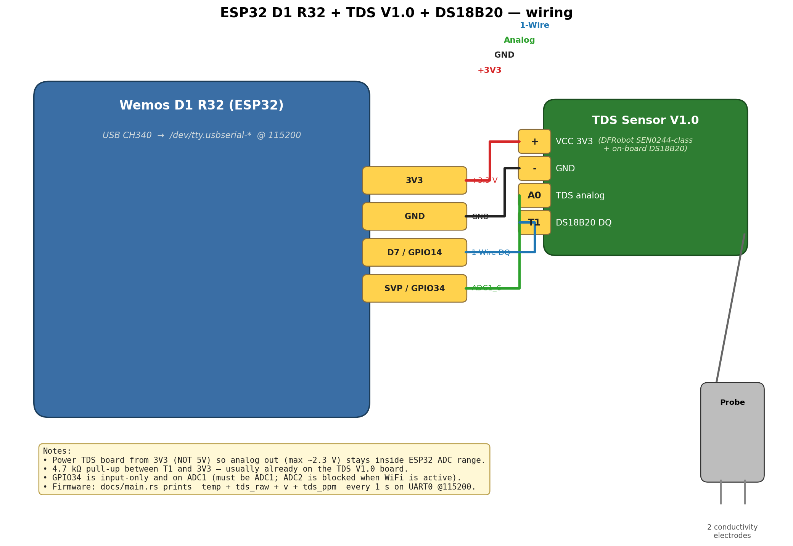

# ESP32 D1 R32 + TDS V1.0 + DS18B20 in Rust (no_std)

Water-quality sensing in Rust on a Wemos **D1 R32 (ESP32)**:

- **TDS** (Total Dissolved Solids, 0–1000 ppm) via a Gravity-class **TDS Sensor V1.0**
  analog board (DFRobot SEN0244 family).
- **Temperature** via the on-board **DS18B20** of the same TDS board (the `T1` pin),
  used both as a standalone reading **and** as the temperature-compensation input
  for the TDS formula.

Output every 1 s over UART0 (CH340 USB serial) at **115200 baud**:

```
temp = 28.500 C | tds_raw =  412 | v = 0.332 V | tds = 142.7 ppm (Vsupply=3.3V)
```

## Wiring



| TDS V1.0 pin | Wemos D1 R32 pin | Function |
|--------------|------------------|----------|
| `+`          | **3V3**          | Supply (do **not** use 5V — analog out would exceed ADC range) |
| `-`          | **GND**          | Ground |
| `A0`         | **GPIO34** (`SVP`) | TDS analog (must be ADC1: 32/33/34/35/36/39) |
| `T1`         | **GPIO14** (`D7`) | DS18B20 1-Wire DQ |

A 4.7 kΩ pull-up between `T1` and `3V3` is required for 1-Wire — usually
already on the TDS V1.0 board.

## One-time toolchain

```bash
curl --proto '=https' --tlsv1.2 -sSf https://sh.rustup.rs | sh
cargo install espup espflash ldproxy
espup install
echo '. $HOME/export-esp.sh' >> ~/.zshrc
. $HOME/export-esp.sh
```

macOS: install the **CH340/CH341** driver from WCH if `/dev/tty.wchusbserial*`
does not appear.

## Build, flash, monitor

Plug the board in, then:

```bash
. $HOME/export-esp.sh
cargo build --release
espflash flash --port /dev/tty.usbserial-110 \
  target/xtensa-esp32-none-elf/release/esp32-d1r32-ds18b20
python3 -c 'import serial, time
s = serial.Serial("/dev/tty.usbserial-110", 115200, timeout=0.5)
s.setRTS(True); time.sleep(0.1); s.setDTR(False); s.setRTS(False)
while True:
    d = s.read(256)
    if d: print(d.decode("utf-8", errors="replace"), end="", flush=True)'
```

The `cargo run` runner with `espflash --monitor` opens a TUI that does not
play nicely with non-TTY shells; the Python `pyserial` snippet above is a
plain monitor that works everywhere.

Replace `/dev/tty.usbserial-110` with whatever `ls /dev/tty.usbserial-*`
shows on your machine. Install pyserial once via
`python3 -m pip install --break-system-packages pyserial`.

## Change the pins

In `src/main.rs`:

- `peripherals.GPIO14` — DS18B20 / `T1` 1-Wire pin. On D1 R32 this clone's
  silkscreen `D7` maps to GPIO14 (confirmed by 1-Wire pin scan). Other
  commonly-mapped pins on D1 R32 boards: D2=26, D3=25, D4=17, D5=16, D6=27,
  D8=12. Avoid strapping pins (GPIO0/2/12/15) for the 1-Wire bus.
- `peripherals.GPIO34` — TDS / `A0` analog pin. **Must** be on ADC1
  (GPIO 32/33/34/35/36/39) because ADC2 is unusable while WiFi is active.
  GPIO34/35/36/39 are input-only — that's fine for a sensor input.

## How TDS is computed

The board's analog out is conditioned voltage proportional to water
conductivity. The reference algorithm (DFRobot SEN0244):

```text
comp     = 1.0 + 0.02 · (T - 25)              # +2 %/°C
V_comp   = V_adc / comp
TDS_ppm  = (133.42·V_comp³ - 255.86·V_comp² + 857.39·V_comp) · 0.5
```

Sampling: 30 ADC samples spaced 5 ms apart (~150 ms total) → trimmed mean of
the middle 20 to reject outliers from the probe's ~1 kHz AC excitation.

## Regenerate the wiring diagram

```bash
python3 -m pip install --break-system-packages matplotlib
python3 docs/draw_wiring.py
```
